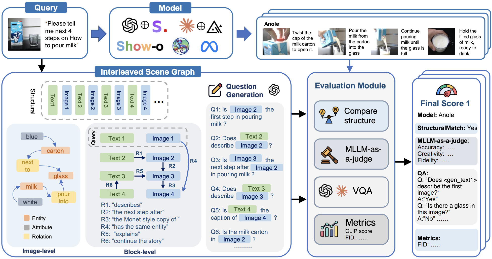
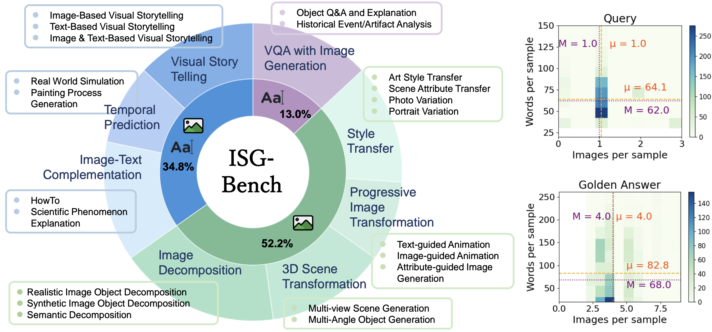
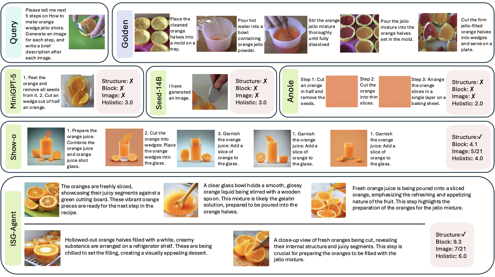
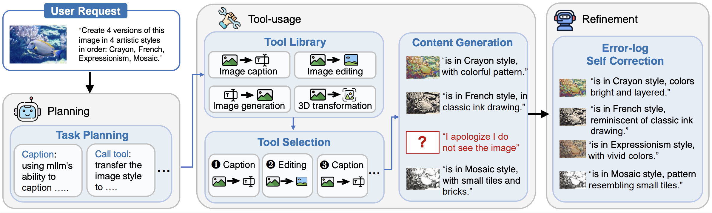
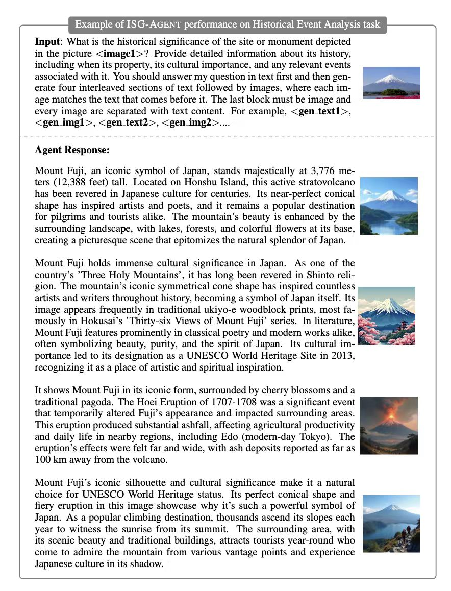

<div align="center">
<h1>Interleaved Scene Graph for Interleaved Text-and-Image Generation Assessment</h1>

[](https://interleaved-eval.github.io/)
[](https://arxiv.org/abs/2411.17188)
[](https://huggingface.co/datasets/shuaishuaicdp/ISG)



<p align="center">

</p>
</div>

## Updates & News
- [27/11/2024] :page_facing_up: We release our [paper](https://arxiv.org/abs/2411.17188) and [dataset](https://github.com/Dongping-Chen/ISG) today!
  
## Contents
- [Updates \& News](#updates--news)
- [Contents](#contents)
- [Interleaved Scene Graph](#interleaved-scene-graph)
  - [Environment Setup](#environment-setup)
  - [Repository Management](#repository-management)
- [Evaluating Your Own Model](#evaluating-your-own-model)
- [ISG-Agent: Exploring the Upper Bound for Interleaved Generation](#isg-agent-exploring-the-upper-bound-for-interleaved-generation)
- [Acknowledgments](#acknowledgments)
- [Citation](#citation)

## Interleaved Scene Graph



This evaluation method and benchmark is designed for evaluating interleaved generation in four levels: Structural, Block, Image, and Holistic. It is an well established testbed for model can perform both multimodal understanding and generation such as [Show-o](https://github.com/showlab/Show-o) and [Anole](https://github.com/GAIR-NLP/anole).

### Environment Setup
Given that we mainly use GPT-4o for VQA in *Image* and *Block* level as well as MLLM-as-a-Judge in *Holistic* level, you can simply setup by: `pip install openai`.

### Repository Management

```markdown
/ISG_eval
├── images (You should download it from huggingface and place here)
├── ISG-Bench.jsonl
├── ...
```

1. **images**: Contains images in queries and golden answer. You can download it from [here](https://) and place them under ISG_eval.

2. **ISG-Bench.jsonl**: Contains ground truth compiled previously by ISG. One data sample is as follows. It contains `Query` for question and `Golden` for human-annotated golden answer.

```json
{
    "id": "0000",
    "Category": "Prediction",
    "Query": [
        {
            "type": "text",
            "content": "I will give you a picture of a person washing their hands. Please use a combination of 4 images and text to show what will happen next. Please generate an overall description first, then directly generate adjacent image blocks. For example, [whole description] <object1 image> <object2 image> <object3 image> <object4 image>."
        },
        {
            "type": "image",
            "content": "images/0000_q1.jpg"
        }
    ],
    "Golden": [
        {
            "type": "text",
            "content": "The person continues to scrub their hands thoroughly, with the soap lathering up. The hands are cleaned under running water, and the lather is rinsed away."
        },
        {
            "type": "image",
            "content": "images/0000_g1.jpg"
        },
        {
            "type": "image",
            "content": "images/0000_g2.jpg"
        },
        {
            "type": "image",
            "content": "images/0000_g3.jpg"
        },
        {
            "type": "image",
            "content": "images/0000_g4.jpg"
        }
    ],
    "predict": {
        "structural": {
            "Query": [
                "<query_text1>",
                "<query_img1>"
            ],
            "Answer": [
                "<gen_text1>",
                "<gen_img1>",
                "<gen_img2>",
                "<gen_img3>",
                "<gen_img4>"
            ]
        },
        "block_tuple": {
            "relation": [
                [
                    "<gen_text1>",
                    "<query_img1>",
                    "is an overall description of"
                ],
                ...
            ]
        },
        "block_qa": {
            "questions": [
                {
                    "subject": "<gen_text1>",
                    "object": "<query_img1>",
                    "relation": "is an overall description of",
                    "Question": "Does <gen_text1> describe this image?"
                },
                ...
            ]
        },
        "image_tuple": [
            [
                "entity",
                "hands",
                "<gen_img1>"
            ],
            ...
        ],
        "image_qa": {
            "questions": [
                {
                    "image": "<gen_img1>",
                    "Question": "Are there hands in this image?",
                    "id": 0,
                    "Preliminary": []
                },
                ...
            ]
        }
    }
}
```

## Evaluating Your Own Model


Once you get your model's output, manage them as a JsonLine file, where each the answer for each id is under key `output`:

```json
{
    "id": "0000",
    "Category": "Prediction",
    "output": [
        {
            "type": "text",
            "content": "<text-content>"
        },
        {
            "type": "image",
            "content": "<path_of_the_input_image>"
        }
    ]
}
```

Then, run the following script:

```shell
python ISG-eval.py --input_file <your file>
python summarize_performance.py --input_file <output of ISG-eval.py>
```

## ISG-Agent: Exploring the Upper Bound for Interleaved Generation


ISG-Agent is a compositional framework that leverage tools to generate high-quality interleaved content while strictly follows user's query. 


ISG-Agent will output interleaved image and text results. You can run evaluation on ISG-Agent.

Please See `ISG_agent/README.md` for enviroment setup and how to use. You can also reproduct the experiment result by comparing to the chart.

| Category   | Model     | Avg.  | Style | Prog. | 3D    | Dec.  | I-T C. | Temp. | VST   | VQA   |
|------------|-----------|-------|-------|-------|-------|-------|--------|-------|-------|-------|
| Block      | ISG-AGENT | 5.515 | 5.391 | 6.181 | 6.081 | 4.243 | 6.408  | 6.816 | 5.678 | 3.321 |
| Image      | ISG-AGENT | 0.574 | 0.538 | 0.752 | 0.359 | 0.617 | 0.368  | 0.670 | 0.713 | -     |
| Structural | ISG-AGENT | 0.871 | 0.944 | 0.967 | 0.788 | 0.902 | 0.800  | 1.000 | 0.987 | 0.577 |
| Holistic   | ISG-AGENT | 6.262 | 5.873 | 6.459 | 4.887 | 7.582 | 6.932  | 4.540 | 7.030 | 6.795  |

## Acknowledgments

This project is a follow-up of [MLLM-as-a-Judge](https://arxiv.org/pdf/2402.04788). This work is partially funded by Toyota Motor Corporation. We’d also like to extend a thank you to [Jieyu Zhang](https://jieyuz2.github.io/), [Weikai Huang](https://weikaih04.github.io/), and [Zixian Ma](https://zixianma.github.io/) for their insightful feedback and support.

## Citation

```
@article{chen2024interleaved,
      title={Interleaved Scene Graph for Interleaved Text-and-Image Generation Assessment}, 
      author={Dongping Chen and Ruoxi Chen and Shu Pu and Zhaoyi Liu and Yanru Wu and Caixi Chen and Benlin Liu and Yue Huang and Yao Wan and Pan Zhou and Ranjay Krishna},
      journal={arXiv preprint arXiv:2411.17188}, 
      year={2024},
}
```
